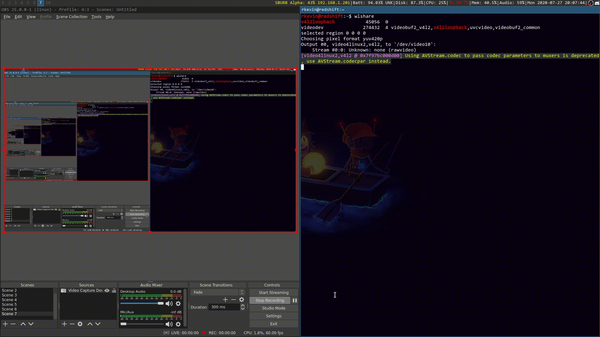

# CLIDrag

This is a CLI tool that simulates dragging files into GUI applications.

## Demo



## Use case

I'm primarily a Linux command line user who rarely use GUI file managers. When I want to send a file through Discord or something similar, I either have to a) open Nautilus, find the file and drag it over, or b) use the file picker and dig through my files. Using this tool, you can just start a drag from the CLI and send the file(s) to your desired GUI application.

## Dependencies

This depends on Qt5, which should hopefully be on most distros by default.

## Compilation

You'll need qmake and g++ to compile this program. A Dockerfile is provided, and I used the following command in the git directory to build the program:

```sh
docker build -t build-drag . && docker run -it --rm -v `pwd`:/src build-drag
```

Afterwards, the binary should be in the `bin` folder.

## License and contributing

[Do whatever the heck you want with this code.](http://www.wtfpl.net/) No credit necessary. Make whatever issues and PRs you want, and I'll fix the issue / merge the PR it if its reasonable.
